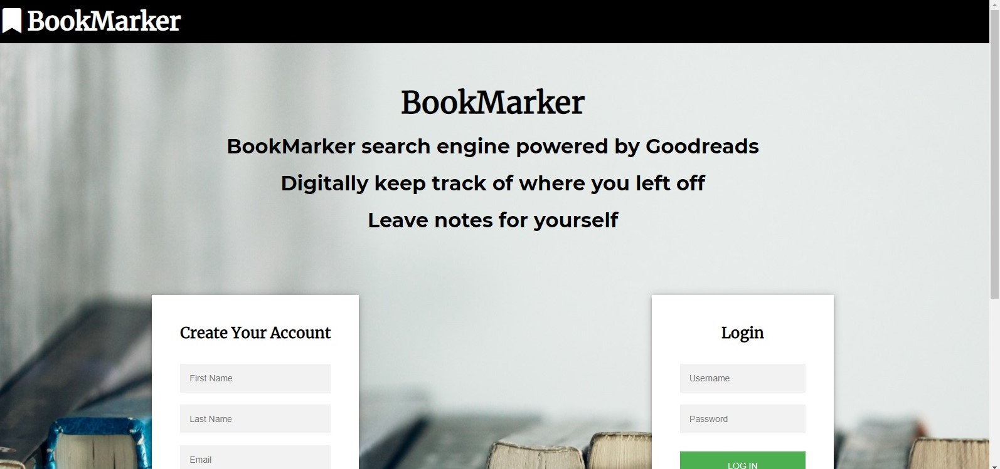

# BookMarker

You find can my app: https://bookmarker-1.herokuapp.com/

## Screenshots

## Motivation:
 You may have the same problem I do. You keep buying books and your friends, coworkes, or just random people on the internet are recommending all these books for you to read. I want to help people keep track of what books they're reading. If you are reading mulitple books at once its good to have a place where you can store what page you are on, how you felt at the time, and keep track of what books are in your ever expanding wishlist of books to read. I've built BookMarker to help you out.

### Main Tools:
    HTML
    CSS
    Javascript
    React
### Built with:
    Server-side:
        bcryptjs
        body-parser
        cookie-parser
        dotenv 
        ejs
        express
        express-session
        jsonwebtoken
        mongoose
        morgan
        node-fetch
        passport
        passport-jwt
        passport-local
        xml-js
    Client-Side:
        react-scripts
        jwt-decode
        react
        react-dom
        react-redux
        react-router
        react-router-dom
        redux
        redux-form
        redux-thunk
### Tested with:
    Server-side:    
        chai
        chai-http
        faker
        mocha
        supertest
    Client-side:
        enzyme
        enzyme-adapter-react-16
        react-test-renderer
